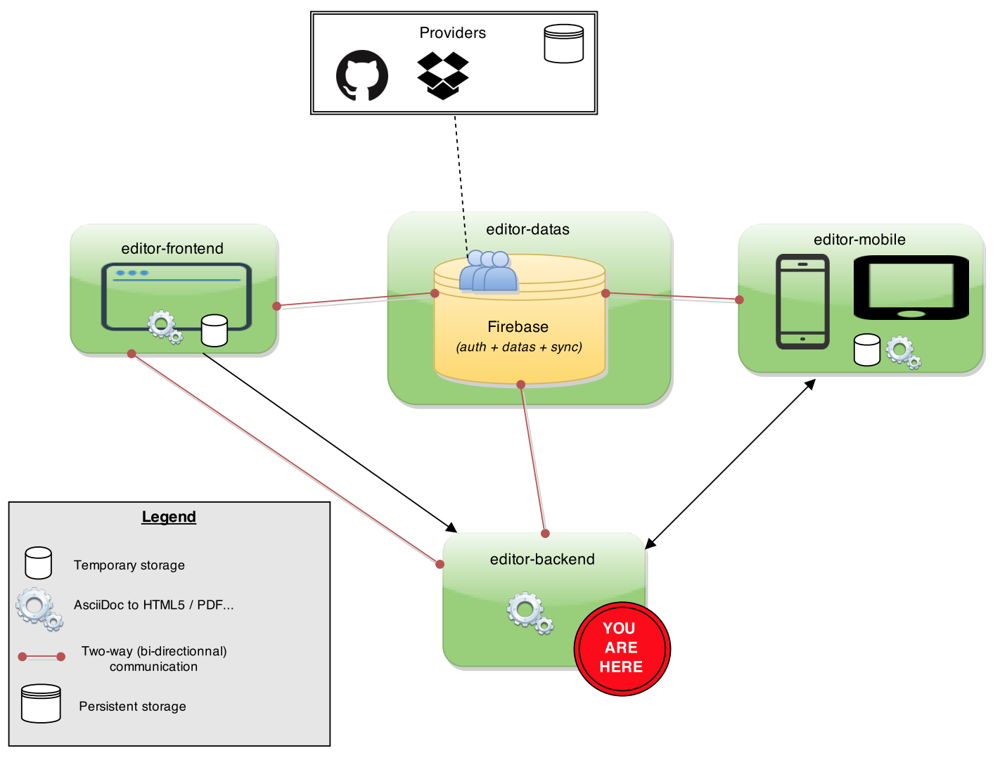

= editor-backend

Backend : convert AsciiDoc to HTML5 and PDF files

== Overview

[[backend]]
.Architecture Overview

== How to test it ?

. Prerequisite

.. Have a Firebase account
.. Active a secret key

. Clone the project

  git clone https://github.com/adoc-editor/editor-backend

. Build a container

.. From the adoc-editor Dockerfile

  cd editor-backend/deployment
  docker build --rm --tag="editor-backend" `dirname "$0"`

  docker rm -f backend && docker run  -p 8080:8080 -p 9990:9990 --name backend -e "editor.backend.firebase.url=<FIREBASE_URL>" -e "editor.backend.firebase.secret=<FIREBASE_SECRET>" -it editor-backend
  example :
  docker rm -f backend
  docker run  -p 8080:8080 -p 9990:9990 --name backend -e "editor.backend.firebase.secret=Q5Ro9fnlklR95JScdSTuNEtg3Da8aSPobdyCs7fZ" -it editor-backend

. Build the WAR
. Deploy the app

. Active a converter (PDF, HTML5...) to an AsciiDoc file with the REST API

  http://192.168.99.100:8080/editor-backend/api/project/project:123/file/file:123/listener/html5

. Download the file

  http://192.168.99.100:8080/docs/<name>.(pdf|html)